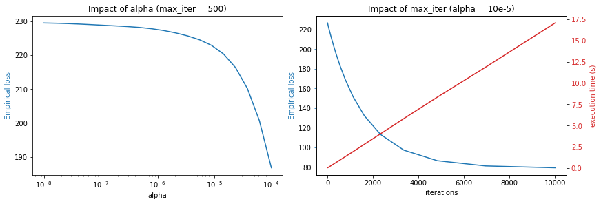
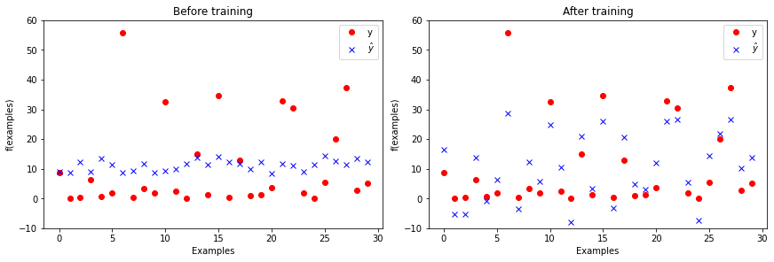

# Supervised Machine Learning Report 

<br/>Students : Théo Fontana - Vatosoa Razafiniary - Dimitrios Nixarlidis - 4IR SC
<br/>Github access : https://github.com/Vatosoa285/TP_ML.git
<br/>This report gathers the work done in the labs of the machine learning course. It has 3 parts that corresponds to the different labs seen :

- lab 1: decision trees
- lab 2: Perceptron
- lab 3: multi-layer perceptron

The instructions of the labs being quite directive, we took the time to consult the resources provided (about maching learning notions or Python functions) in addition to our courses to carry out and understand the labs. For an easy understanding for the reader, we have put explanatory comments in our codes and displayed the results at runtime.

# Lab 1 : decision trees

In the following, we consider the  (binarized) Compas dataset that we studied in the Lab

```python
from sklearn import tree
from matplotlib import pyplot as plt # for a good visualization of the trees

import csv
import numpy as np
from utils import load_from_csv

from sklearn.model_selection import train_test_split
from sklearn.model_selection import cross_val_score
from sklearn.metrics import confusion_matrix

```


```python
train_examples, train_labels, features, prediction = load_from_csv("./compass.csv") 
print ("We can see here that we work with binarized data :\n",train_examples, "\n-------\n",train_labels)
```


A decision tree configuration is a set of parameters that one can use to build decision trees. Propose 6 configurations that are likely to provide different topologies and caracteristics

```python
#our proposition : affecting different values for the parameters splitter, max_depth and min_samples_leaf 
treesParmeters = [
    #expected topology and caracteristic
    {'splitter':'best', 'max_depth': 2, 'min_samples_leaf': 1},
    {'splitter':'random', 'max_depth': 10, 'min_samples_leaf': 100},
    {'splitter':'best', 'max_depth': 5, 'min_samples_leaf': 20},
    {'splitter':'best', 'max_depth': 5, 'min_samples_leaf':5},
    {'splitter':'best', 'max_depth': 100, 'min_samples_leaf':50},
    {'splitter':'best', 'max_depth': 100, 'min_samples_leaf':60},
]
nbTree = len(treesParmeters)
print("We have configured :", nbTree, "different decision trees here")
```
    We have configured : 6 different decision trees here
Train a decision tree for each of the previous configurations on the full dataset

```python
for i in range (nbTree) :
    parameters= treesParmeters[i]
    clf = tree.DecisionTreeClassifier( #while creating each tree, we work with the parameters configured above
        splitter=parameters['splitter'],
        max_depth =parameters['max_depth'],
        min_samples_leaf =parameters['min_samples_leaf']
    )
    clf = clf.fit(train_examples, train_labels)   
    plt.figure(figsize=(10,10))
    tree.plot_tree(clf, 
                       feature_names= (features),
                       class_names= ("recidiviste", "non recidiviste"), 
                       filled=True)
    plt.show()
    # Result : we can visually check that we obtain 6 different trees
    #Each tree is coherent with the expected topology and characteristic parametered 
```
    

    
    

    
    

    
    

    
    

    
    

    
Propose an evaluation in terms of training and testing accuracies using $5$-cross validation on two decision trees that have different typologies


```python
# We only keep the two first topologies
treesParmeters = treesParmeters[:2]
nbTree = len(treesParmeters)
```


```python
for i in range (nbTree) :
    parameters= treesParmeters[i]
    clf = tree.DecisionTreeClassifier(
        splitter=parameters['splitter'],
        max_depth =parameters['max_depth'],
        min_samples_leaf =parameters['min_samples_leaf']
    )
    X_train, X_test, y_train, y_test = train_test_split(train_examples, train_labels, test_size=0.2, random_state=1)

    clf = clf.fit(X_train, y_train)
    scores = cross_val_score(clf, X_test, y_test, cv=5)
    print("The tree number %0.2i has %0.2f accuracy with a standard deviation of %0.2f" % (i,scores.mean(), scores.std()))
    plt.figure(figsize=(10,7))
    tree.plot_tree(clf, 
                       feature_names= (features),
                       class_names= ("recidiviste", "non recidiviste"), 
                       filled=True)
    plt.show()
```

    The tree number 00 has 0.65 accuracy with a standard deviation of 0.03

    

    

    The tree number 01 has 0.65 accuracy with a standard deviation of 0.02

    

    


Propose an experimental study that shows the transition phase from underfitting to overfitting 

```python
parameters= treesParmeters[0]
accuracy =[]
test_sizes=np.linspace(0.01,0.8,30)
for test_size in test_sizes :
    clf = tree.DecisionTreeClassifier(
        splitter=parameters['splitter'],
        max_depth =parameters['max_depth'],
        min_samples_leaf =parameters['min_samples_leaf']
    )
    X_train, X_test, y_train, y_test = train_test_split(train_examples, train_labels, test_size=test_size, random_state=42)

    clf = clf.fit(X_train, y_train)
    scores = cross_val_score(clf, X_test, y_test, cv=2)
    accuracy.append(scores.mean())
    #print(f"for a test size of {1/i} we have an accuracy of {scores.mean()} with a standard deviation of {scores.std()}")
plt.title('Accuracy according to test size ')
plt.plot(test_sizes,accuracy)
plt.show()
```
    
 
    

### Remarks
* We reach a maximal accuracy around 0.67 for a 0.15 <test_size_ref< 0.19 (slitghly inferior to 0.2)
* With small tests size, we have bad result because our graph is to close of our data 
    - **this is overfitting**
* With high tests size, our results start to be be lower because the graph is constructed with too few data
    - **this is underfitting**

Construct the confusion matrix on a particular good configuration (after explaining your choice)

```python
test_size = 0.16 #according to the previous analysis we will set this value to test_size 

X_train, X_test, y_train, y_test = train_test_split(train_examples, train_labels, test_size=test_size, random_state=1)
parameters= treesParmeters[1] #according to resutls in [entry 9], we will keep tree 1 for this  experiment (having the best standard deviation)

clf = tree.DecisionTreeClassifier(
        splitter=parameters['splitter'],
        max_depth =parameters['max_depth'],
        min_samples_leaf =parameters['min_samples_leaf']
    )
clf = clf.fit(X_train, y_train)
y_predict = clf.predict(X_test)
print("Accuracy of the model : ",accuracy_score(y_test,y_predict))

#confusion_matrix
print("Confusion matrix")
conf_mx = confusion_matrix(y_test,y_predict, labels=clf.classes_)
disp = ConfusionMatrixDisplay(confusion_matrix=conf_mx,display_labels=clf.classes_)

disp.plot()
plt.show()
```
    Accuracy of the model :  0.6718009478672986
    Confusion matrix
    
 
       
Provide an evaluation of the fairness of the model based on the False Positive Rate

```python
print("% of prisoners correctly predicted recidivist ou not by our model :", (conf_mx[0,0]+conf_mx[1,1])/len(y_test)*100, "%")
print(" % of recidivist prisoners correctly predicted recidivist our model :",conf_mx[0,0]/(conf_mx[0,0]+conf_mx[1,0])*100,"%")
print("% of non-recidivist prisoners correctly predicted non-recidivist our model :",conf_mx[1,1]/(conf_mx[0,1]+conf_mx[1,1])*100,"%")
```
    % of prisoners correctly predicted recidivist ou not by our model : 67.18009478672985 %
     % of recidivist prisoners correctly predicted recidivist our model : 65.33333333333333 %
    % of non-recidivist prisoners correctly predicted non-recidivist our model : 70.21943573667711 %
    
We can see that our model has an accuracy of 67.10% which is pretty average. Based on the two last percentages (true recidivists and true non-recidivists) our model is not fair because it predicts with lower accuracy the recidivists (65.33%) compared to the non-ones(70.21%)
--> A possibility is to reaching a more fair model is to increase gradually the value of test_size beetween 0.16 to 0.25 for example according to the accuracy according to test size figure.

# Lab2 : Perceptron

## Objectives of the practical work

The objective is to get hands on experience on the fundamental elements of neural networks:
 
 - perceptron architecture (linear regression)
 - loss function
 - empirical loss
 - gradient descent

For this we will implement from scratch the data-structure and algorithms to train a perceptron. Note that slides related to the perceptron and neural networks in general are available on [moodle](https://moodle.insa-toulouse.fr/course/view.php?id=1822#section-2).

## Dataset

The objective of the regression is the prediction of the hydrodynamic performance of sailing yachts from dimensions and velocity.
The **inputs** are linked to dimension and hydrodynamics characteristics:
1. Longitudinal position of the center of buoyancy
(*flottabilité*), adimensional.
2. Prismatic coefficient, adimensional.
3. Length-displacement ratio, adimensional.
4. Beam -draught ratio ((*tiran d’eau*), adimensional.
5. Length-beam ratio, adimensional.
6. Froude number, adimensional

**Target value/predicted value (Output)** = Residuary resistance per unit weight of
displacement, adimensional

```python
# Import some useful libraries and functions
import numpy as np
import pandas
import matplotlib.pyplot as plt
import copy
import time

def print_stats(dataset):
    """Print statistics of a dataset"""
    print(pandas.DataFrame(dataset).describe())
```


```python
# Download the data set and place in the current folder (works on linux only)
filename = 'yacht_hydrodynamics.data'

import os.path
import requests

if not os.path.exists(filename):
    print("Downloading dataset...")
    r = requests.get('https://arbimo.github.io/tp-supervised-learning/tp2/' + filename)
    open(filename , 'wb').write(r.content)
    
print('Dataset available')
```

    Dataset available


### Explore the dataset

- how many examples are there in the dataset?
- how many features for each example?
- what is the ground truth of the 10th example


```python
# loads the dataset and slip between inputs (X) and ground truth (Y)
dataset = np.genfromtxt("yacht_hydrodynamics.data", delimiter='')
X = dataset[:, :-1] # examples features
Y = dataset[:, -1]  # ground truth

# Print the first 5 examples
for i in range(0,5):
    print(f"f({X[i]}) = {Y[i]}")
#Answer to the questions
print ("There are", len(dataset), "examples in the dataset, each example has", len(X[0]), "features")
print ("The ground truth of the 10th example is", f"f({X[9]}) = {Y[9]}")
```

    f([-5.    0.6   4.78  4.24  3.15  0.35]) = 8.62
    f([-5.     0.565  4.77   3.99   3.15   0.15 ]) = 0.18
    f([-2.3    0.565  4.78   5.35   2.76   0.15 ]) = 0.29
    f([-5.     0.6    4.78   4.24   3.15   0.325]) = 6.2
    f([0.    0.53  4.78  3.75  3.15  0.175]) = 0.59
    There are 308 examples in the dataset, each example has 6 features
    The ground truth of the 10th example is f([-5.     0.565  4.77   3.99   3.15   0.25 ]) = 1.83
    


The following command adds a column to the inputs.

- what is in the value added this column?
- why are we doing this?
**Answer: -> the np.insert() function adds a column (the column 0) that has for value an additional dataset that has a specific characteristic.As detailed by the print_stats() function it contains only "1". This is useful to add the perceptron constant w_0.**

```python
#to be excuted only once 
X = np.insert(X, 0, np.ones((len(X))), axis= 1)
print_stats(X) #after the insert raw 0 was replaced with w_0 and the previous existing raws were just shifted 
```
               0           1           2           3           4           5  \
    count  308.0  308.000000  308.000000  308.000000  308.000000  308.000000   
    mean     1.0   -2.381818    0.564136    4.788636    3.936818    3.206818   
    std      0.0    1.513219    0.023290    0.253057    0.548193    0.247998   
    min      1.0   -5.000000    0.530000    4.340000    2.810000    2.730000   
    25%      1.0   -2.400000    0.546000    4.770000    3.750000    3.150000   
    50%      1.0   -2.300000    0.565000    4.780000    3.955000    3.150000   
    75%      1.0   -2.300000    0.574000    5.100000    4.170000    3.510000   
    max      1.0    0.000000    0.600000    5.140000    5.350000    3.640000   
    
                    6  
    count  308.000000  
    mean     0.287500  
    std      0.100942  
    min      0.125000  
    25%      0.200000  
    50%      0.287500  
    75%      0.375000  
    max      0.450000  


## Creating the perceptron

We now want to define a perceptron, that is, a function of the form: 


- Complete the code snippet below to:
  - create the vector of weight `w`
  - implement the `h` function that evaluate an example based on the vector of weights
  - check if this works on a few examples


```python
nb_features = len(X[0])
w = np.ones(nb_features) # w is set here as a vector unit, with that value h(w,x) = sum[X]

def h(w, x):
    return np.dot(x,w)  

# print the ground truth and the evaluation of ground truth on the 4 first examples
for i in range(0,4):
    print (" For X =",X[i]," expected_h_w is :",Y[i]) 
    print ("The value calculated by the function h is h_w = ",h(w,X[i]))
# we can see a tangible loss between the values and that is understandable 
# the w set here does not necessarily fit the one that will converge the most to the real ground truth expected
```
    For X = [ 1.   -5.    0.6   4.78  4.24  3.15  0.35]  expected_h_w is : 8.62
    The value calculated by the function h is h_w =  9.120000000000001
     For X = [ 1.    -5.     0.565  4.77   3.99   3.15   0.15 ]  expected_h_w is : 0.18
    The value calculated by the function h is h_w =  8.625
     For X = [ 1.    -2.3    0.565  4.78   5.35   2.76   0.15 ]  expected_h_w is : 0.29
    The value calculated by the function h is h_w =  12.305
     For X = [ 1.    -5.     0.6    4.78   4.24   3.15   0.325]  expected_h_w is : 6.2
    The value calculated by the function h is h_w =  9.095

## Loss function

Complete the definiton of the loss function below such that, for a **single** example `x` with ground truth `y`, it returns the $L_2$ loss of $h_w$ on `x`.

```python
def loss(w, x, y):
    return (h(w,x)-y)**2
    
print(f"The L_2 loss of the first example is {loss(w,X[0],Y[0]):.2f}")
```
    The L_2 loss of the first example is 0.25


## Empirical loss

Complete the function below to compute the empirical loss of $h_w$ on a **set** of examples $X$ with associated ground truths $Y$.


```python
def emp_loss(w, X, Y):
    empLoss =0
    for i in range (len(X)):
        empLoss+= loss(w, X[i],Y[i])
    return (empLoss/len(X))

print(f"The empirical loss of the set of examples is  {emp_loss(w,X,Y):.2f}")
```
    The empirical loss of the set of examples is  229.63


## Gradient update

A gradient update is of the form: $w \gets w + dw$

- Complete the function below so that it computes the $dw$ term (the 'update') based on a set of examples `(X, Y)` the step (`alpha`)

If you are not sure about the gradient computation, check out the [perceptron slides](https://moodle.insa-toulouse.fr/pluginfile.php/120391/mod_resource/content/1/cm1.pdf) on [Moodle](https://moodle.insa-toulouse.fr/course/view.php?id=1822) (in particular, slide 26). Make sure this computation is clear to you!


```python
def compute_update(w, X, Y, alpha):
    nb_features = len(X[0])
    nb_data = len(X)

    w_copy= copy.deepcopy(w)
    for i in range(nb_features):
        dw =0
        for j in range(nb_data):
            dw+= (Y[j]-h(w_copy, X[j]))*X[j][i]
        w[i]+= alpha*dw
```

## Gradient descent

Now implement the gradient descent algorithm that will:

- repeatedly apply an update the weights 
- stops when a max number of iterations is reached (do not consider early stopping for now)
- returns the final vector of weights


```python
def descent(w_init, X, Y, alpha, max_iter):
    w_final =copy.deepcopy(w_init)
    for i in range (max_iter):
        compute_update(w_final, X, Y, alpha)
    return w_final
```

## Exploitation

You gradient descent is now complete and you can exploit it to train your perceptron.

- Train your perceptron to get a model.
- Visualize the evolution of the loss on the training set. Has it converged?
- Try training for several choices of `alpha` and `max_iter`. What seem like a reasonable choice?
- What is the loss associated with the final model?
- Is the final model the optimal one for a perceptron?


```python
w_init = np.ones((len(X[0])))
w_final = descent(w_init, X, Y, alpha = 10e-8, max_iter=100)
```

### Impact of `alpha` and `max_iter`


```python
Alphas=np.logspace(-8,-4,20,base=10)
LossAlpha=[]

for alpha in Alphas:
    w_final = descent(w_init, X, Y, alpha = alpha, max_iter=500)
    LossAlpha.append(emp_loss(w_final, X, Y))
```


```python
Iters=np.logspace(1,4,20).astype(int)
LossIter=[]
executionTime=[]

for iter in Iters:
    st=time.time()
    w_final = descent(w_init, X, Y, alpha = 10e-5, max_iter=iter)
    et=time.time()-st
    LossIter.append(emp_loss(w_final, X, Y))
    executionTime.append(et)
```

```python
fig, axs = plt.subplots(1, 2, constrained_layout=True)

color = 'tab:blue'
axs.flat[0].plot(Alphas,LossAlpha)
axs.flat[0].set_title('Impact of alpha (max_iter = 500)')
axs.flat[0].set_xlabel('alpha')
axs.flat[0].set_xscale('log')
axs.flat[0].set_ylabel('Empirical loss',color='tab:blue')

axs.flat[1].set_title('Impact of max_iter (alpha = 10e-5)')
axs.flat[1].set_xlabel('iterations')
axs.flat[1].set_ylabel('Empirical loss', color='tab:blue')
axs.flat[1].plot(Iters, LossIter, color='tab:blue')
axs.flat[1].tick_params(axis='y', color='tab:blue')

ax2 = axs.flat[1].twinx()
color = 'tab:red'
ax2.set_ylabel('execution time (s)', color='tab:red') 
ax2.plot(Iters, executionTime, color='tab:red')
ax2.tick_params(axis='y', labelcolor='tab:red')

plt.show()
```
    

    
ANALYSIS on the training parameters 'alpha' and 'max_iter'
* `alpha`
    We noticed that using a step too small during the decent isn't performant, however if we use a step too big we can't create the model due to overflow.We found that using a step of `alpha = 10e-5` create the bests results.

* `max_iter`
    Increasing the number of iterations allow to reduce the empirical loss, however after 8000 iteration our model seams to have converged. After that the decent takes more time and doesn't improve the perfomance much. That is why we will use max_iter = 8000 for our final model

### Our final model

```python
w_init = np.ones((len(X[0])))
w_final = descent(w_init, X, Y, alpha = 10e-5, max_iter=8000)
```

```python
print(f"The empirical loss of our first model was {emp_loss(w_init, X, Y):.2f}")
print(f"The empirical loss of our final model is {emp_loss(w_final, X, Y):.2f}")
```

    The empirical loss of our first model was 229.63
    The empirical loss of our final model is 80.08
    
```python
num_samples_to_plot = 30

fig, axs = plt.subplots(1, 2, constrained_layout=True)
axs.flat[0].plot(Y[0:num_samples_to_plot], 'ro', label='y')
yw = [h(w_init,x) for x in X]

axs.flat[0].plot(yw[0:num_samples_to_plot], 'bx', label='$\hat{y}$')
axs.flat[0].legend()
axs.flat[0].set_title("Before training")
axs.flat[0].set_xlabel("Examples")
axs.flat[0].set_ylim([-10, 60])
axs.flat[0].set_ylabel("f(examples)")

axs.flat[1].plot(Y[0:num_samples_to_plot], 'ro', label='y')
yw = [h(w_final,x) for x in X]
axs.flat[1].plot(yw[0:num_samples_to_plot], 'bx', label='$\hat{y}$')
axs.flat[1].set_title("After training")
axs.flat[1].legend()
axs.flat[1].set_xlabel("Examples")
axs.flat[1].set_ylim([-10, 60])
axs.flat[1].set_ylabel("f(examples)")
plt.show()

# We can see below that after training, we are closer to the expected behavior (without coinciding exactly to it). 
# Is that final model the optimal one for a perceptron?
#-> It is a model generated with the optimal parameters found from the gradient descent 
```
    
   

## Going further
The following are extensions of the work previously done. If attempting them **do not modify** the code you produced above so that it can be evaluated.

### Improvements to gradient descent
Consider improving the gradient descent with:

 - Stochastic Gradient Descent (SGD), which means selecting a subset of the examples for training
 - Detection of convergence to halt the algorithm before the maximum number of iterations

### Data normalization
Different input features can have different units, and very different ranges.
Within the perceptron computation, these values will be summed together.
While gradient descent is normally able to deal with this (by adapting the weights of the perceptron for each input feature), standardizing the input features usually eases the perceptron training, and can sometimes improve accuracy.

```python
from sklearn.preprocessing import StandardScaler
sc = StandardScaler(copy=True) 
X_normalized = sc.fit_transform(X)
```
Try applying a standard normalization to the input features (make sure that you keep a feature column that is always equal to 1). Is the convergence faster ? Try to quantify this speed-up. What about accuracy ?


# Lab 3 : Multi-Layer Perceptron
## Introduction

The objective of this lab is to dive into particular kind of neural network: the *Multi-Layer Perceptron* (MLP).

To start, let us take the dataset from the previous lab (hydrodynamics of sailing boats) and use scikit-learn to train a MLP instead of our hand-made single perceptron.
The code below is already complete and is meant to give you an idea of how to construct an MLP with scikit-learn. You can execute it, taking the time to understand the idea behind each cell.


```python
# Importing the dataset
import numpy as np
dataset = np.genfromtxt("yacht_hydrodynamics.data", delimiter='')
X = dataset[:, :-1]
Y = dataset[:, -1]
```


```python
# Preprocessing: scale input data 
from sklearn.preprocessing import StandardScaler
sc = StandardScaler()
X = sc.fit_transform(X)
```


```python
# Split dataset into training and test set
from sklearn.model_selection import train_test_split
x_train, x_test, y_train, y_test = train_test_split(X, Y,random_state=1, test_size = 0.20)
```


```python
# Define a multi-layer perceptron (MLP) network for regression
from sklearn.neural_network import MLPRegressor
mlp = MLPRegressor(max_iter=3000, random_state=1) # define the model, with default params
mlp.fit(x_train, y_train) # train the MLP
```


    MLPRegressor(max_iter=3000, random_state=1)


```python
# Evaluate the model
from matplotlib import pyplot as plt
from matplotlib.pyplot import figure

print('Train score: ', mlp.score(x_train, y_train))
print('Test score:  ', mlp.score(x_test, y_test))
plt.plot(mlp.loss_curve_)
plt.xlabel("Iterations")
plt.ylabel("Loss")

fig = plt.gcf()
fig.set_size_inches(5, 4)
plt.show()
```

    Train score:  0.9940765369322633
    Test score:   0.9899773031580283
    

    
```python
# Plot the results
num_samples_to_plot = 20
plt.plot(y_test[0:num_samples_to_plot], 'ro', label='y')
yw = mlp.predict(x_test)
plt.plot(yw[0:num_samples_to_plot], 'bx', label='$\hat{y}$')
plt.legend()
plt.xlabel("Examples")
plt.ylabel("f(examples)")

fig = plt.gcf()
fig.set_size_inches(5, 4)
plt.show()
```
    

   

### Analyzing the network

Many details of the network are currently hidden as default parameters.

Using the [documentation of the MLPRegressor](https://scikit-learn.org/stable/modules/generated/sklearn.neural_network.MLPRegressor.html), answer the following questions.
- What is the structure of the network?
     <br/>3 layers, the hidden layer has 100 percetrons
- What it is the algorithm used for training? Is there algorithm available that we mentioned during the courses?
     <br/>The default value ‘adam’ refers to a stochastic gradient-based optimizer proposed by Kingma, Diederik, and Jimmy Ba
- How does the training algorithm decides to stop the training?
     <br/>It stops the training after max_iter itterations are done, there is no early stopping by default.

## Onto a more challenging dataset: house prices

For the rest of this lab, we will use the (more challenging) [California Housing Prices dataset](https://www.kaggle.com/datasets/camnugent/california-housing-prices).

```python
# clean all previously defined variables for the sailing boats
%reset -f

# Import the required modules
from sklearn.datasets import fetch_california_housing
from sklearn.model_selection import train_test_split
from sklearn.preprocessing import StandardScaler
from sklearn.neural_network import MLPRegressor
from sklearn.preprocessing import StandardScaler
import pandas as pd
import matplotlib.pyplot as plt
import numpy as np
import time
import copy

```

```python
num_samples = 3000 # only use the first N samples to limit training time

cal_housing = fetch_california_housing()
X = pd.DataFrame(cal_housing.data,columns=cal_housing.feature_names)[:num_samples]
Y = cal_housing.target[:num_samples]

X.head(10) # print the first 10 values
```


<div>

<table border="1" class="dataframe">
  <thead>
    <tr style="text-align: right;">
      <th></th>
      <th>MedInc</th>
      <th>HouseAge</th>
      <th>AveRooms</th>
      <th>AveBedrms</th>
      <th>Population</th>
      <th>AveOccup</th>
      <th>Latitude</th>
      <th>Longitude</th>
    </tr>
  </thead>
  <tbody>
    <tr>
      <th>0</th>
      <td>8.3252</td>
      <td>41.0</td>
      <td>6.984127</td>
      <td>1.023810</td>
      <td>322.0</td>
      <td>2.555556</td>
      <td>37.88</td>
      <td>-122.23</td>
    </tr>
    <tr>
      <th>1</th>
      <td>8.3014</td>
      <td>21.0</td>
      <td>6.238137</td>
      <td>0.971880</td>
      <td>2401.0</td>
      <td>2.109842</td>
      <td>37.86</td>
      <td>-122.22</td>
    </tr>
    <tr>
      <th>2</th>
      <td>7.2574</td>
      <td>52.0</td>
      <td>8.288136</td>
      <td>1.073446</td>
      <td>496.0</td>
      <td>2.802260</td>
      <td>37.85</td>
      <td>-122.24</td>
    </tr>
    <tr>
      <th>3</th>
      <td>5.6431</td>
      <td>52.0</td>
      <td>5.817352</td>
      <td>1.073059</td>
      <td>558.0</td>
      <td>2.547945</td>
      <td>37.85</td>
      <td>-122.25</td>
    </tr>
    <tr>
      <th>4</th>
      <td>3.8462</td>
      <td>52.0</td>
      <td>6.281853</td>
      <td>1.081081</td>
      <td>565.0</td>
      <td>2.181467</td>
      <td>37.85</td>
      <td>-122.25</td>
    </tr>
    <tr>
      <th>5</th>
      <td>4.0368</td>
      <td>52.0</td>
      <td>4.761658</td>
      <td>1.103627</td>
      <td>413.0</td>
      <td>2.139896</td>
      <td>37.85</td>
      <td>-122.25</td>
    </tr>
    <tr>
      <th>6</th>
      <td>3.6591</td>
      <td>52.0</td>
      <td>4.931907</td>
      <td>0.951362</td>
      <td>1094.0</td>
      <td>2.128405</td>
      <td>37.84</td>
      <td>-122.25</td>
    </tr>
    <tr>
      <th>7</th>
      <td>3.1200</td>
      <td>52.0</td>
      <td>4.797527</td>
      <td>1.061824</td>
      <td>1157.0</td>
      <td>1.788253</td>
      <td>37.84</td>
      <td>-122.25</td>
    </tr>
    <tr>
      <th>8</th>
      <td>2.0804</td>
      <td>42.0</td>
      <td>4.294118</td>
      <td>1.117647</td>
      <td>1206.0</td>
      <td>2.026891</td>
      <td>37.84</td>
      <td>-122.26</td>
    </tr>
    <tr>
      <th>9</th>
      <td>3.6912</td>
      <td>52.0</td>
      <td>4.970588</td>
      <td>0.990196</td>
      <td>1551.0</td>
      <td>2.172269</td>
      <td>37.84</td>
      <td>-122.25</td>
    </tr>
  </tbody>
</table>
</div>


Note that each row of the dataset represents a **group of houses** (one district). The `target` variable denotes the average house value in units of 100.000 USD. Median Income is per 10.000 USD.

### Extracting a subpart of the dataset for testing

- Split the dataset between a training set (75%) and a test set (25%)

Please use the conventional names `X_train`, `X_test`, `y_train` and `y_test`.


```python
X_train, X_test, Y_train,Y_test = train_test_split(X, Y,random_state=1, test_size = 0.25)
```

### Scaling the input data


A step of **scaling** of the data is often useful to ensure that all input data centered on 0 and with a fixed variance.

Standardization of a dataset is a common requirement for many machine learning estimators: they might behave badly if the individual features do not more or less look like standard normally distributed data (e.g. Gaussian with 0 mean and unit variance). The function `StandardScaler` from `sklearn.preprocessing` computes the standard score of a sample as:

```
z = (x - u) / s
```

where `u` is the mean of the training samples, and `s` is the standard deviation of the training samples.

Centering and scaling happen independently on each feature by computing the relevant statistics on the samples in the training set. Mean and standard deviation are then stored to be used on later data using transform.

 - Apply the standard scaler to both the training dataset (`X_train`) and the test dataset (`X_test`).
 - Make sure that **exactly the same transformation** is applied to both datasets.

[Documentation of standard scaler in scikit learn](https://scikit-learn.org/stable/modules/generated/sklearn.preprocessing.StandardScaler.html)


```python
scaler = StandardScaler()

X_train=scaler.fit_transform(X_train)
X_test =scaler.transform(X_test) #we only use scaler.transform to keep the same parametter 
```

## Overfitting

In this part, we are only interested in maximizing the **train score**, i.e., having the network memorize the training examples as well as possible.

- Propose a parameterization of the network (shape and learning parameters) that will maximize the train score (without considering the test score).

While doing this, you should (1) remain within two minutes of training time, and (2) obtain a score that is greater than 0.90.

- Is the **test** score substantially smaller than the **train** score (indicator of overfitting) ?
- Explain how the parameters you chose allow the learned model to overfit.


```python
h_layer=[]
train_score_layers=[]
test_score_layers=[]
nb_layers=[i for i in range(2,12)]
for i in range(10):
    h_layer.append(100)
    mlp = MLPRegressor(max_iter=3000, random_state=1,hidden_layer_sizes=tuple(h_layer))
    mlp.fit(X_train, Y_train)
    train_score_layers.append(mlp.score(X_train, Y_train))
    test_score_layers.append(mlp.score(X_test, Y_test))
```


```python
iter=np.linspace(500,2000,10).astype(int)
train_score_iterations=[]
test_score_iterations=[]
for nb_iter in iter:
    mlp = MLPRegressor(max_iter=nb_iter, random_state=1, hidden_layer_sizes=(50,50))
    mlp.fit(X_train, Y_train)
    train_score_iterations.append(mlp.score(X_train, Y_train))
    test_score_iterations.append(mlp.score(X_test, Y_test))
```


```python
fig, axs = plt.subplots(1, 2, constrained_layout=True)

fig.set_size_inches(10,4)
axs.flat[0].plot(nb_layers,train_score_layers,'go',label='training score')
axs.flat[0].plot(nb_layers,test_score_layers,'ro',label='tests score')
axs.flat[0].legend()
axs.flat[0].set_title('Impact of the number of layers')
axs.flat[0].set_xlabel("number of layers")
axs.flat[0].set_ylabel('score')

axs.flat[1].plot(iter, train_score_iterations,'g',label='training score')
axs.flat[1].plot(iter, test_score_iterations,'r',label='tests score')
axs.flat[1].legend()
axs.flat[1].set_title('Impact of the number of iterrations')
axs.flat[1].set_xlabel("number of layers")
axs.flat[1].set_ylabel('score')

plt.show()
```


    

    


### Remarks
* We remark that the test score is alway smaller than teh train score 
* Using a great number of layers cause overfitting &#8658; The train scrore increase while the test score decrease

    A large number of layers allow the model to be closer to the train data 
* The number of itteration doesn't seams to have an impact on overfitting

## Hyperparameter tuning

In this section, we are now interested in maximizing the ability of the network to predict the value of unseen examples, i.e., maximizing the **test** score.
You should experiment with the possible parameters of the network in order to obtain a good test score, ideally with a small learning time.

Parameters to vary:

- number and size of the hidden layers
- activation function
- stopping conditions
- maximum number of iterations
- initial learning rate value

Results to present for the tested configurations:

- Train/test score
- training time


Present in a table the various parameters tested and the associated results. You can find in the last cell of the notebook a code snippet that will allow you to plot tables from python structure.
Be methodical in the way your run your experiments and collect data. For each run, you should record the parameters and results into an external data structure.

(Note that, while we encourage you to explore the solution space manually, there are existing methods in scikit-learn and other learning framework to automate this step as well, e.g., [GridSearchCV](https://scikit-learn.org/stable/modules/generated/sklearn.model_selection.GridSearchCV.html))


```python
parameters= [
    {'activation': 'tanh', 'max_iter': 4000, 'early_stopping': False, 'hidden_layer_sizes':(50,50), 'learning_rate_init':0.001, 'learning_rate':'constant', 'val_score': None, 'test_score': None, 'train_score': None, 'training_time':None},
    {'activation': 'relu', 'max_iter': 1000, 'early_stopping': True, 'hidden_layer_sizes':(50, 50,  50), 'learning_rate_init':0.001, 'learning_rate':'constant', 'val_score': None, 'test_score': None, 'train_score': None, 'training_time':None},
    {'activation': 'tanh', 'max_iter': 10000, 'early_stopping': False, 'hidden_layer_sizes':(50,), 'learning_rate_init':0.001, 'learning_rate':'adaptive', 'val_score': None, 'test_score': None, 'train_score': None, 'training_time':None},
    {'activation': 'relu', 'max_iter': 1000, 'early_stopping': False, 'hidden_layer_sizes':(50,50), 'learning_rate_init':0.001, 'learning_rate':'constant', 'val_score': None, 'test_score': None, 'train_score': None, 'training_time':None},
    {'activation': 'logistic', 'max_iter': 3000, 'early_stopping': False, 'hidden_layer_sizes':(50,50), 'learning_rate_init':0.001, 'learning_rate':'adaptive', 'val_score': None, 'test_score': None, 'train_score': None, 'training_time':None},
    {'activation': 'tanh', 'max_iter': 1000, 'early_stopping': False, 'hidden_layer_sizes':(50,), 'learning_rate_init':0.001, 'learning_rate':'constant', 'val_score': None, 'test_score': None, 'train_score': None, 'training_time':None},
    {'activation': 'tanh', 'max_iter': 1000, 'early_stopping': False, 'hidden_layer_sizes':(50,), 'learning_rate_init':0.001, 'learning_rate':'constant', 'val_score': None, 'test_score': None, 'train_score': None, 'training_time':None},
    {'activation': 'tanh', 'max_iter': 1000, 'early_stopping': False, 'hidden_layer_sizes':(50,), 'learning_rate_init':0.001, 'learning_rate':'constant', 'val_score': None, 'test_score': None, 'train_score': None, 'training_time':None},
    {'activation': 'logistic', 'max_iter': 600, 'early_stopping': False, 'hidden_layer_sizes':(50,), 'learning_rate_init':0.01, 'learning_rate':'adaptive', 'val_score': None, 'test_score': None, 'train_score': None, 'training_time':None},
    {'activation': 'tanh', 'max_iter': 1000, 'early_stopping': False, 'hidden_layer_sizes':(50,), 'learning_rate_init':0.001, 'learning_rate':'constant', 'val_score': None, 'test_score': None, 'train_score': None, 'training_time':None},
]
```


```python
def find_best_parametter(X_train,X_val,Y_train, Y_val, parameters):
    Parameters = copy.deepcopy(parameters)
    for prm in Parameters:
        mlp = MLPRegressor(
            activation=prm['activation'],
            max_iter=prm['max_iter'],
            hidden_layer_sizes=prm['hidden_layer_sizes'],
            learning_rate_init=prm['learning_rate_init'],
            learning_rate=prm['learning_rate'],
            early_stopping=prm['early_stopping']
        )
        
        st = time.time()
        mlp.fit(X_train, Y_train)
        et = time.time() - st
        prm['train_score'] = mlp.score(X_train, Y_train)
        prm['val_score'] = mlp.score(X_val, Y_val)
        prm['training_time'] = et
    return Parameters
```


```python
# Code snippet to display a nice table in jupyter notebooks  (remove from report)
checked_prms = find_best_parametter(X_train,X_test,Y_train, Y_test, parameters)

table = pd.DataFrame.from_dict(checked_prms)
table = table.replace(np.nan, '-')
table = table.sort_values(by='val_score', ascending=False)
table
```


<div>
<table border="1" class="dataframe">
  <thead>
    <tr style="text-align: right;">
      <th></th>
      <th>activation</th>
      <th>max_iter</th>
      <th>early_stopping</th>
      <th>hidden_layer_sizes</th>
      <th>learning_rate_init</th>
      <th>learning_rate</th>
      <th>val_score</th>
      <th>test_score</th>
      <th>train_score</th>
      <th>training_time</th>
    </tr>
  </thead>
  <tbody>
    <tr>
      <th>0</th>
      <td>tanh</td>
      <td>4000</td>
      <td>False</td>
      <td>(50, 50)</td>
      <td>0.001</td>
      <td>constant</td>
      <td>0.865599</td>
      <td>-</td>
      <td>0.875062</td>
      <td>3.314819</td>
    </tr>
    <tr>
      <th>5</th>
      <td>tanh</td>
      <td>1000</td>
      <td>False</td>
      <td>(50,)</td>
      <td>0.001</td>
      <td>constant</td>
      <td>0.865209</td>
      <td>-</td>
      <td>0.863621</td>
      <td>1.573738</td>
    </tr>
    <tr>
      <th>8</th>
      <td>logistic</td>
      <td>600</td>
      <td>False</td>
      <td>(50,)</td>
      <td>0.010</td>
      <td>adaptive</td>
      <td>0.861801</td>
      <td>-</td>
      <td>0.858189</td>
      <td>0.471554</td>
    </tr>
    <tr>
      <th>6</th>
      <td>tanh</td>
      <td>1000</td>
      <td>False</td>
      <td>(50,)</td>
      <td>0.001</td>
      <td>constant</td>
      <td>0.859807</td>
      <td>-</td>
      <td>0.862771</td>
      <td>1.577773</td>
    </tr>
    <tr>
      <th>7</th>
      <td>tanh</td>
      <td>1000</td>
      <td>False</td>
      <td>(50,)</td>
      <td>0.001</td>
      <td>constant</td>
      <td>0.856682</td>
      <td>-</td>
      <td>0.858054</td>
      <td>1.211859</td>
    </tr>
    <tr>
      <th>9</th>
      <td>tanh</td>
      <td>1000</td>
      <td>False</td>
      <td>(50,)</td>
      <td>0.001</td>
      <td>constant</td>
      <td>0.855972</td>
      <td>-</td>
      <td>0.859859</td>
      <td>1.329147</td>
    </tr>
    <tr>
      <th>2</th>
      <td>tanh</td>
      <td>10000</td>
      <td>False</td>
      <td>(50,)</td>
      <td>0.001</td>
      <td>adaptive</td>
      <td>0.855211</td>
      <td>-</td>
      <td>0.849904</td>
      <td>1.293586</td>
    </tr>
    <tr>
      <th>4</th>
      <td>logistic</td>
      <td>3000</td>
      <td>False</td>
      <td>(50, 50)</td>
      <td>0.001</td>
      <td>adaptive</td>
      <td>0.848674</td>
      <td>-</td>
      <td>0.847081</td>
      <td>5.032111</td>
    </tr>
    <tr>
      <th>3</th>
      <td>relu</td>
      <td>1000</td>
      <td>False</td>
      <td>(50, 50)</td>
      <td>0.001</td>
      <td>constant</td>
      <td>0.839223</td>
      <td>-</td>
      <td>0.893153</td>
      <td>2.051382</td>
    </tr>
    <tr>
      <th>1</th>
      <td>relu</td>
      <td>1000</td>
      <td>True</td>
      <td>(50, 50, 50)</td>
      <td>0.001</td>
      <td>constant</td>
      <td>0.831973</td>
      <td>-</td>
      <td>0.843345</td>
      <td>0.538187</td>
    </tr>
  </tbody>
</table>
</div>


## Evaluation

- From your experiments, what seems to be the best model (i.e. set of parameters) for predicting the value of a house?

Unless you used cross-validation, you have probably used the "test" set to select the best model among the ones you experimented with.
Since your model is the one that worked best on the "test" set, your selection is *biased*.

In all rigor the original dataset should be split in three:

- the **training set**, on which each model is trained
- the **validation set**, that is used to pick the best parameters of the model 
- the **test set**, on which we evaluate the final model


Evaluate the score of your algorithm on a test set that was not used for training nor for model selection.


```python
X_tr, X_test, Y_tr,Y_test = train_test_split(X, Y,random_state=1, test_size = 0.20) # 20% for testing
X_train, X_val, Y_train,Y_val = train_test_split(X_tr, Y_tr,random_state=1, test_size = 0.25) # 20% for validation

scaler = StandardScaler()
X_train=scaler.fit_transform(X_train)
X_val =scaler.transform(X_val) #we only use scaler.transform to keep the same parametter 
X_test =scaler.transform(X_test) #we only use scaler.transform to keep the same parametter 

df =  pd.DataFrame.from_dict(find_best_parametter(X_train,X_val,Y_train, Y_val,parameters))
df = df.replace(np.nan, '-')

df = df.sort_values(by='val_score', ascending=False)
df

```


<div>

<table border="1" class="dataframe">
  <thead>
    <tr style="text-align: right;">
      <th></th>
      <th>activation</th>
      <th>max_iter</th>
      <th>early_stopping</th>
      <th>hidden_layer_sizes</th>
      <th>learning_rate_init</th>
      <th>learning_rate</th>
      <th>val_score</th>
      <th>test_score</th>
      <th>train_score</th>
      <th>training_time</th>
    </tr>
  </thead>
  <tbody>
    <tr>
      <th>0</th>
      <td>tanh</td>
      <td>4000</td>
      <td>False</td>
      <td>(50, 50)</td>
      <td>0.001</td>
      <td>constant</td>
      <td>0.827788</td>
      <td>-</td>
      <td>0.866743</td>
      <td>2.036587</td>
    </tr>
    <tr>
      <th>5</th>
      <td>tanh</td>
      <td>1000</td>
      <td>False</td>
      <td>(50,)</td>
      <td>0.001</td>
      <td>constant</td>
      <td>0.818846</td>
      <td>-</td>
      <td>0.868004</td>
      <td>1.533499</td>
    </tr>
    <tr>
      <th>2</th>
      <td>tanh</td>
      <td>10000</td>
      <td>False</td>
      <td>(50,)</td>
      <td>0.001</td>
      <td>adaptive</td>
      <td>0.818130</td>
      <td>-</td>
      <td>0.863551</td>
      <td>1.300022</td>
    </tr>
    <tr>
      <th>8</th>
      <td>logistic</td>
      <td>600</td>
      <td>False</td>
      <td>(50,)</td>
      <td>0.010</td>
      <td>adaptive</td>
      <td>0.817825</td>
      <td>-</td>
      <td>0.868591</td>
      <td>0.545273</td>
    </tr>
    <tr>
      <th>9</th>
      <td>tanh</td>
      <td>1000</td>
      <td>False</td>
      <td>(50,)</td>
      <td>0.001</td>
      <td>constant</td>
      <td>0.815315</td>
      <td>-</td>
      <td>0.855915</td>
      <td>0.964416</td>
    </tr>
    <tr>
      <th>3</th>
      <td>relu</td>
      <td>1000</td>
      <td>False</td>
      <td>(50, 50)</td>
      <td>0.001</td>
      <td>constant</td>
      <td>0.813041</td>
      <td>-</td>
      <td>0.889887</td>
      <td>1.635100</td>
    </tr>
    <tr>
      <th>7</th>
      <td>tanh</td>
      <td>1000</td>
      <td>False</td>
      <td>(50,)</td>
      <td>0.001</td>
      <td>constant</td>
      <td>0.811582</td>
      <td>-</td>
      <td>0.848408</td>
      <td>0.905025</td>
    </tr>
    <tr>
      <th>6</th>
      <td>tanh</td>
      <td>1000</td>
      <td>False</td>
      <td>(50,)</td>
      <td>0.001</td>
      <td>constant</td>
      <td>0.809922</td>
      <td>-</td>
      <td>0.845506</td>
      <td>0.769561</td>
    </tr>
    <tr>
      <th>1</th>
      <td>relu</td>
      <td>1000</td>
      <td>True</td>
      <td>(50, 50, 50)</td>
      <td>0.001</td>
      <td>constant</td>
      <td>0.792135</td>
      <td>-</td>
      <td>0.854870</td>
      <td>0.656084</td>
    </tr>
    <tr>
      <th>4</th>
      <td>logistic</td>
      <td>3000</td>
      <td>False</td>
      <td>(50, 50)</td>
      <td>0.001</td>
      <td>adaptive</td>
      <td>0.787650</td>
      <td>-</td>
      <td>0.839308</td>
      <td>2.576903</td>
    </tr>
  </tbody>
</table>
</div>


```python
best_params = df[df.val_score == df.val_score.max()].to_dict('records')[0]
```


```python
mlp = MLPRegressor(
            activation=best_params['activation'],
            max_iter=best_params['max_iter'],
            hidden_layer_sizes=best_params['hidden_layer_sizes'],
            learning_rate_init=best_params['learning_rate_init'],
            learning_rate=best_params['learning_rate'],
            early_stopping=best_params['early_stopping']
        )

st = time.time()
mlp.fit(X_train, Y_train)
et = time.time() - st
# best_params['train_score'] = mlp.score(X_train.values, Y_train)
best_params['test_score'] = mlp.score(X_test, Y_test)
best_params['training_time'] = et
results = pd.DataFrame.from_dict([best_params])
results
```

<div>

<table border="1" class="dataframe">
  <thead>
    <tr style="text-align: right;">
      <th></th>
      <th>activation</th>
      <th>max_iter</th>
      <th>early_stopping</th>
      <th>hidden_layer_sizes</th>
      <th>learning_rate_init</th>
      <th>learning_rate</th>
      <th>val_score</th>
      <th>test_score</th>
      <th>train_score</th>
      <th>training_time</th>
    </tr>
  </thead>
  <tbody>
    <tr>
      <th>0</th>
      <td>tanh</td>
      <td>4000</td>
      <td>False</td>
      <td>(50, 50)</td>
      <td>0.001</td>
      <td>constant</td>
      <td>0.827788</td>
      <td>0.86979</td>
      <td>0.866743</td>
      <td>2.12866</td>
    </tr>
  </tbody>
</table>
</div>


### Remarks
* In the current version of our code we train our model two times
    * For selecting the best parameters
    * For the final test of th model
    
    It will be better if our function `find_best_parametter` returned the model that performed best during selection phase along side with the parameters.
